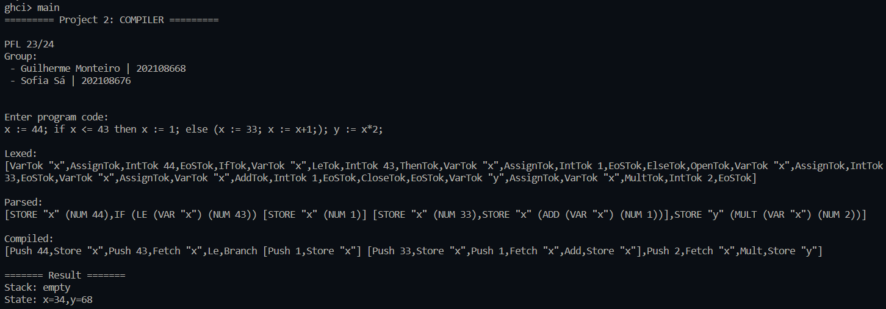
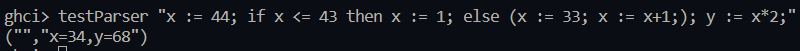

# Haskell Project - Compiler

### Grade: 19.67/20.0

## Group T06_G02

|Name | Contribution |
|---------------------------------------------|-----|
|Guilherme Brandão Monteiro (up202108668)     | 50% |
|Sofia Resende Ferreira de Sá (up202108676)   | 50% |


## Descrição do Projeto


For this project, we were proposed to implement a compiler for a high-level language, in order to run it on a low-level machine. The language went through several stages in order to be converted into a list of instructions that the machine can interpret.

To do this, the project was divided into 2 parts, comprised of a total of 3 subtasks:
- **Parser** *(Part 2.2)*: the Parser receives the input, which is a program written in a high-level language, and converts it into a list of tokens, from the lexer. Then, buildData receives the list of tokens and transforms it into `Data`, which is an internal representation of the program.
- **Compiler** *(Part 2.1)*: receives the `Data` and converts it into low-level, assembly code, interpretable by the machine.
- **Assembler** *(Part 1)*: receives the assembly code and executes it, producing the final output.


## Project Execution

To run this project you need to compile the `main.hs` file. To execute the program in a small interface (which provides a visual execution of each step), run the command `main` in the terminal and provide the string with the code you want to run when prompted to. Example:



For a more condensed execution, run the command `textParser <code>`.




## Parser

The **Parser module** acts as a bridge between the raw input program and the Compiler.  By calling the `lexer` (created in a different module - **Lexer module**) it ensures that the program is correctly tokenized , followed by the `buildData` which transforms the token sequence into the correct structure of the program, before it is passed to the Compiler for further processing.

### Part I: Lexer

In our project, the **Lexer module** plays a crucial role in the initial phase of processing the source code. It's responsible for lexical analysis, which is the process of converting a sequence of characters into a sequence of tokens.

The lexer recognizes a variety of tokens, including keywords like "while", "do", "if", "then", "else", and "var". It also recognizes operators such as "+", "-", "*", and ":=", as well as parentheses, integers, boolean values, and the end of statement symbol ";".

The VarTok token represents a variable, which always starts with a lowercase letter according to our language's syntax rules. The AssignTok token represents the assignment operator, which assigns a value to a variable.

The `Token` data type represents all the possible tokens that the lexer can recognize. 

```haskell
-- Token: A data type representing the different tokens that can be produced by the lexer.
data Token
    = OpenTok           -- "("
    | CloseTok          -- ")"
    -- Artithmetic
    | AddTok            -- "+"
    | MultTok           -- "*"
    | SubTok            -- "-"
    | IntTok Int        -- "123" -> int
    -- Boolean
    | TruTok            -- "True"
    | FalsTok           -- "False"
    | EqITok            -- "=="
    | LeTok             -- "<="
    | EqBTok            -- "="
    | NotTok            -- "not"
    | AndTok            -- "and"
    -- While
    | WhileTok          -- "while"
    | DoTok             -- "do"
    -- If
    | IfTok             -- "if"
    | ThenTok           -- "then"
    | ElseTok           -- "else"
    -- Variable
    | VarTok String     -- "var" -> always starts with lowercase
    | AssignTok         -- ":=" -> assign value to variable
    -- end of statement
    |EoSTok             -- ";"
    deriving (Show)
```

By breaking down the source code into these **tokens**, the lexer simplifies the code into a format that's easier for the parser to handle. This sets the stage for the parser to analyze the token sequence according to the rules of our programming language's grammar.

The main function of this module is the `lexer` function which takes a string and returns a list of tokens. It uses pattern matching to determine which token to return based on the current character. It uses the auxiliary functions lexDigit and lexAlpha to handle numbers and more complex tokens like keywords and variables, respectively.

### Part II: buildData 

The function `buildData` is responsible for syntax analysis or parsing. It checks the token sequence against the rules of our programming language's grammar, ensuring that the program is syntactically correct and generates the corresponding syntax tree.

The parser recognizes the structure of various programming expressions, such as `if then else` statements, `while do` loops, variable assignments and arithmetic and boolean expressions. 

To represent these expressions, the Parser module uses three data types:
- `Aexp` represents arithmetic expressions, such as integer numbers, addition, multiplication and subtraction. Includes standalone variables.

```haskell
-- Aexp: Data type that represents arithmetic expressions
data Aexp --arithmetic expressions
    = NUM Integer -- integer constants
    | ADD Aexp Aexp -- addition node
    | MULT Aexp Aexp -- multiplication node
    | SUB Aexp Aexp -- subtraction node
    | VAR String -- get the value of a variable
    deriving Show
```

- `Bexp` represents boolean expressions, such as boolean values, logical AND, logical NOT, equality and less than or equal to.

```haskell	
-- Bexp: Data type that represents boolean expressions
data Bexp --boolean expressions
    = BOOL Bool -- boolean constants
    | AND Bexp Bexp -- and node
    | NOT Bexp -- not node
    | EQa Aexp Aexp -- equal node --
    | EQb Bexp Bexp -- equal node 
    | LE Aexp Aexp -- less than or equal node
    deriving Show
```

- `Stm` higher level data type represents more complex statements such as IFs, WHILEs and variable assignments, in addition to the Bexp and Aexp data types.

```haskell
-- Stm: Data type that represents statements
data Stm --statements
    = STORE String Aexp-- store node
    | IF Bexp [Stm] [Stm] -- if node
    | WHILE Bexp [Stm] -- loop node
    | AExp Aexp
    | BExp Bexp
    deriving Show
```

The `buildData` function parses the tokens by calling the `parseStms` which recursively handles the parsing of each statement. The function `parseStm` parses a single statement by calling the adequate specialized parser function, depending on the type of statement.  These functions are:
- `parseIf`, which handles the parsing of `if then else` statements. It checks for the presence of the If, Then, and Else tokens and calls `parseBexpOrAexp` (accepting only a boolean response) to parse the condition and `parseStm`/`parseStms` to parse the then/else branches of the statement. These branches can either be a single statement or a block of statements, between parentheses. 
- `parseWhile`, which handles the parsing of `while do` statements. It checks for the presence of the While and Do tokens and recursively calls `parseBexpOrAexp` (accepting only a boolean response) and `parseStm`/`parseStms` to parse the condition and the body of the loop, respectively. As in the case of the if statement, the body can either be a single statement or a block of statements.
- `parseStore`, which handles the parsing of variable assignment statements. It checks for the presence of the Store token and calls parseAexp to parse the expression being assigned to the variable.
- `parseBexpOrAexp`, which handles the parsing of standalone arithmetic and boolean expressions. 

This last function has several auxiliary functions, that start to handle the expressions according to their level of precedence. These functions are named in the form `<Operation>OrHigher` where operation means what is currently being handled and higher means that the function handles the other operations with higher precedence. These are characterized by the following pattern:
- calling the function that handles the operations with higher precedence
- checking if the current token is of the type of the operation being handled
- if so, creating the corresponding expression, otherwise returning the expression created by the function that handles the operations with higher precedence.

The functions `parseIntOrVarOrPar` and `parseBoolOrPar` represent the highest level of precedence, since they handle integer numbers, variables, boolean values and expressions between parenthesis. 

Another aspect taken into account is the associativity of operations, in order to guarantee correct results.


## Compiler


The **Compiler module** is responsible for the compilation process. It takes the abstract syntax tree (AST) produced by the parser and generates a sequence of instructions that can be executed by the machine.

The module defines several functions for compiling different types of expressions:

- `compA` compiles arithmetic expressions (`Aexp`). It handles integer numbers (`NUM`), addition (`ADD`), multiplication (`MULT`) and subtraction (`SUB`). It also handles standalone variables (`VAR`).

- `compB` compiles boolean expressions (`Bexp`). It handles boolean values (`BOOL`), logical AND (`AND`), logical NOT (`NOT`), equality of arithmetic expressions (`EQa`), equality of boolean expressions (`EQb`), and less than or equal to (`LE`).

- `compile` compiles statements (`Stm`). It handles variable assignment (`STORE`), conditional statements (`IF`), and while loops (`WHILE`). It also handles standalone arithmetic and boolean expressions (`AExp` and `BExp`).

The `compile` function is recursive, allowing it to handle a list of statements. For each statement, it generates the appropriate instructions and then recursively compiles the rest of the list.


## Assembler

The **Assembler module** is responsible for the execution of the compiled code. It defines an abstract machine that executes the instructions generated by the compiler.

The module defines several data types:

- `Inst` represents the instructions that the machine can execute. These include arithmetic operations (`Push`, `Add`, `Mult`, `Sub`), boolean operations (`Tru`, `Fals`, `Equ`, `Le`, `And`, `Neg`), variable operations (`Fetch`, `Store`), and control flow operations (`Branch`, `Loop`).
- `Code` is a type alias for a list of instructions (Inst).

```haskell
-- Inst: A data type representing the different instructions that can be executed by the stack machine.
data Inst =
  Push Integer | Add | Mult | Sub | Tru | Fals | Equ | Le | And | Neg | Fetch String | Store String | Noop |
  Branch Code Code | Loop Code Code
  deriving Show
-- Code: A type alias for a list of instructions.
type Code = [Inst]
```

- `ItemBool` is a data type represents the boolean values (TT for True, FF for False) that can be stored on the stack.

- `StackItem`: This data type represents the different types of items that can be stored on the stack. It can be either an integer (N Integer) or a boolean (B ItemBool).

```haskell
-- ItemBool: A data type representing the stack's and state's boolean values.
data ItemBool = TT | FF deriving Show
-- StackItem: A data type representing the different types of items that can be stored on the stack.
data StackItem = N Integer | B ItemBool deriving Show
```

- `Stack` is a type alias for a list of stack items (StackItem).

- `State` is a type alias for a list of key-value pairs, representing the state of the stack machine. Each pair consists of a variable name (String) and its corresponding value (StackItem).

```haskell
-- Stack: A type alias for a list of stack items.
type Stack =  [StackItem]
-- State: A type alias for a list of key-value pairs, representing the state of the stack machine.
type State = [(String, StackItem)]
```

This module also defines several functions for manipulating the stack and the state, converting stack items, stack, and state into strings, and updating the state with new key-value pairs.

The most important function in this file is `run`, which takes a tuple of code, stack, and state, and executes the code on the machine. It uses pattern matching to determine which instruction to execute based on the current state of the machine. The function is recursive, meaning it continues to call itself until all the instructions have been executed.


## Examples of Execution of each part of the project

### Parser

Input:
```
x := 1; y := 2; while x <= 10 do (x := x + 1; y := y * 2;);
```
Intermediate step - Lexed Output:
```
[VarTok "x",AssignTok,IntTok 1,EoSTok,VarTok "y",AssignTok,IntTok 2,EoSTok,WhileTok,VarTok "x",LeTok,IntTok 10,DoTok,OpenTok,VarTok "x",AssignTok,VarTok "x",AddTok,IntTok 1,EoSTok,VarTok "y",AssignTok,VarTok "y",MultTok,IntTok 2,EoSTok,CloseTok,EoSTok]
```

Final Output:
```
[STORE "x" (NUM 1),STORE "y" (NUM 2),WHILE (LE (VAR "x") (NUM 10)) [STORE "x" (ADD (VAR "x") (NUM 1)),STORE "y" (MULT (VAR "y") (NUM 2))]]
```

### Compiler

Input:
```
[STORE "x" (NUM 1),STORE "y" (NUM 2),WHILE (LE (VAR "x") (NUM 10)) [STORE "x" (ADD (VAR "x") (NUM 1)),STORE "y" (MULT (VAR "y") (NUM 2))]]
```

Output:
```
[Push 1,Store "x",Push 2,Store "y",Loop [Push 10,Fetch "x",Le] [Push 1,Fetch "x",Add,Store "x",Push 2,Fetch "y",Mult,Store "y"]]
```

### Assembler

Input:
```
[Push 1,Store "x",Push 2,Store "y",Loop [Push 10,Fetch "x",Le] [Push 1,Fetch "x",Add,Store "x",Push 2,Fetch "y",Mult,Store "y"]]
```

Output:
```
Stack: empty
State: x=11,y=2048
```


## Conclusions

In summary, this project allowed us to consolidate the knowledge acquired throughout the theoretical and practical classes, namely about the Haskell language and its syntax, but also led to the exploration of a new and relevant subject - studying the operation and implementation of a compiler.

Through the completion of this project, we were able to better understand the operation of a compiler, from lexical and syntactic analysis, to the generation of machine code and its execution. All in all, it was a challenging but enriching task and was succcessfully completed.


## Bibliography

- PFL Theoretical Classes' Slides
